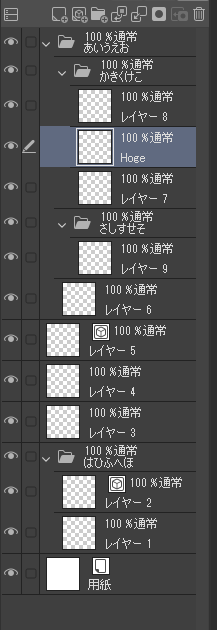
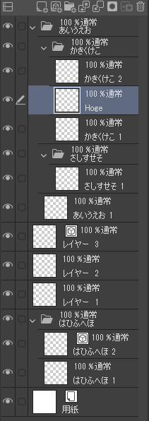

# rename layer

Clip Studio Paintのclip形式ファイルを操作し、「レイヤー 番号」という名前のレイヤーを「親フォルダ名 番号」に変更するツールです。



↓



# Environment

- Rust: 1.55.0
- Cargo: 1.55.0

# Build

```sh
cargo build --release
```

`target/release`フォルダに実行ファイル `renamelayer` が出力されます。

# How to use

```sh
renamelayer Input [Output]
```

- `Input`: 入力 clip ファイル
- `Output`: 出力 clip ファイル（省略可）

Outputを省略した場合は、Inputファイルを上書きします。
上書きする際に、元のファイルは`bk.clip`という拡張子でバックアップします。
同名のバックアップファイルがあった場合は上書きします。

単純にファイルをDrag & Dropでも動きます。
